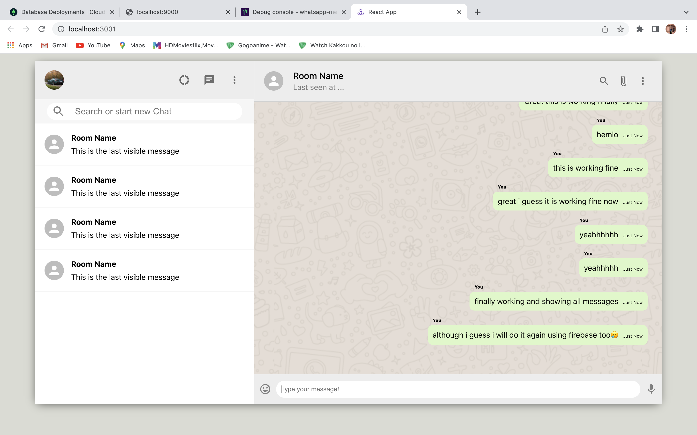

- This is WhatsApp clone with MERN
- It is functional, however currently lacks User authentication to identify the user(sender) and Chat Room

- whatsapp-backend > node server.js
- whatsapp-mern    > npm start

- as MongoDB is not realtime, it is made realtime with the help of Pusher
- currently the app is in progress state, we are able to send and see all messages in the realtime
- Chat Rooms and user authentication is remaining
